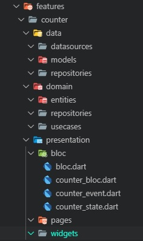
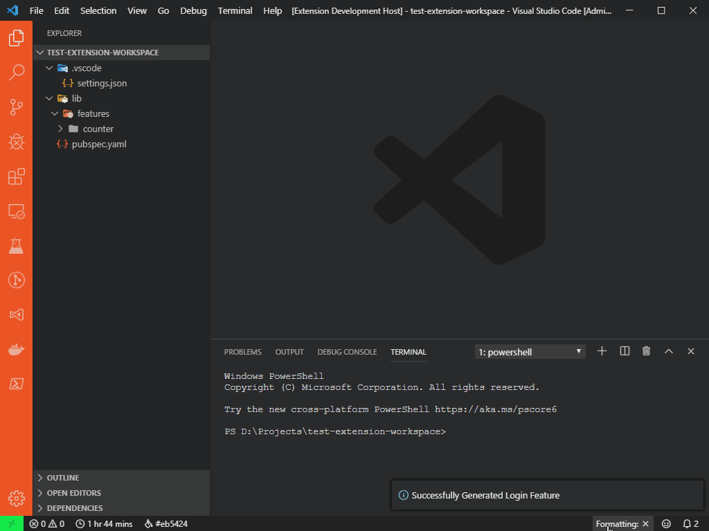
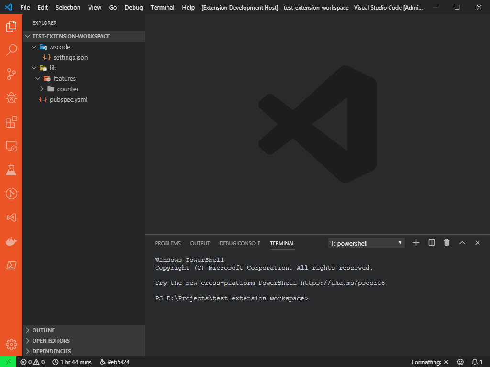

# Flutter Clean Architecture feature scaffolding

> ### This extension is based on [felangel](https://github.com/felangel) BLoC extension

## Introduction

Inspired by the [clean architecture tutorial](https://resocoder.com/2019/08/27/flutter-tdd-clean-architecture-course-1-explanation-project-structure/) by [reso coder](https://github.com/ResoCoder), this extension will help you quickly scaffold a feature.

## Directory structure example

For example, let's take the counter feature:

## Installation

This extension can be installed from the [VSCode Marketplace](https://marketplace.visualstudio.com) or by [searching within VSCode](https://code.visualstudio.com/docs/editor/extension-gallery#_search-for-an-extension).

## New Feature Command Usage

You can activate the command by launching the command palette (View -> Command Palette) and running "Flutter Clean Architecture: New Feature".

Or you can right click on the directory in which you'd like to create the feature and select the "New Feature" command from the context menu.

